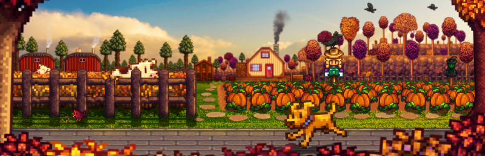

<div align="center">



</div>

A guide on how to **install mods** in **Stardew Valley** on PC. There are also instructions for using [Vortex](https://www.nexusmods.com/about/vortex/), the recommended mod manager by [Nexus Mods](https://www.nexusmods.com/), and how to install mods manually if preferred!

This guide is focused on **Windows users**, but Linux users running Stardew Valley through **Steam Proton** or **Wine** should also find most instructions adaptable!

## Table Of Contents
* [Requirements](#requirements)
* [Game Version Notes](#game-version-notes)
    * [Running Mods On Linux (Proton/Lutris)](#running-mods-on-linux-protonlutris)
* [Backup Your Game Files!](#backup-your-game-files)
* [Installing Vortex Mod Manager](#installing-vortex-mod-manager)
* [Where To Download Mods](#where-to-download-mods)
* [Installing SMAPI (Required for Most Mods)](#installing-smapi-required-for-most-mods)
* [Installing Mods Through Vortex](#installing-mods-through-vortex)
* [Manual Mod Installation (Advanced)](#manual-mod-installation-advanced)
* [Updating Mods](#updating-mods)
* [Removing Mods](#removing-mods)
* [Conclusion](#conclusion)
* [See Also](#see-also)

## Requirements
* Stardew Valley installed via Steam, GOG, or Microsoft Store
* A free [Nexus Mods](https://www.nexusmods.com) account (optional, but recommended)
* [7-Zip](https://www.7-zip.org/) or equivalent archive tool

## Game Version Notes
Stardew Valley modding is generally stable across versions, but mods may break after major game updates.

* Steam and GOG versions fully support mods.
* There are different client configurations for SMAPI depending on your game version. Refer to [this guide](https://stardewvalleywiki.com/Modding:Installing_SMAPI_on_Windows#Configure_your_game_client) for more information!

### Running Mods On Linux (Proton/Lutris)
Stardew Valley has a **Platinum** rating on [ProtonDB](https://www.protondb.com/app/413150), meaning it runs very well on Linux.

* SMAPI runs fine with Proton or native Mono installation.
* Use Protontricks if needed to run .NET mods.
* Linux users can also install SMAPI via the native installer.

## Backup Your Game Files!
We strongly recommend **making backups** of your game and save files. Mods can sometimes cause data corruption and also lead to game crashes. It's just nice having a fallback just in-case of these issues.

To back up your game data, please copy the following folders to a safe location (e.g. your desktop).

Game files:
- **Steam**: `C:\Program Files (x86)\Steam\steamapps\common\Stardew Valley`

Save files:

```
C:\Users\<user>\AppData\Roaming\StardewValley\Saves
```

**WARNING** - Remember the folder locations above as you may need them later on in this guide.

## Installing Vortex Mod Manager
[Vortex](https://www.nexusmods.com/about/vortex/) simplifies the process of downloading, installing, and managing Stardew Valley mods. This is recommended by most users.

To download and setup Vortex, perform the following steps.

1. Download and install Vortex from [here](https://www.nexusmods.com/site/mods/1?tab=files).
2. Launch Vortex.
3. It should detect Stardew Valley. If not:
    * Go to **Games**, search for *Stardew Valley*, and click **Manage**.
    * Manually set the game folder if needed.

## Where To Download Mods
Sources for Stardew Valley mods include the following websites.

* [Nexus Mods](https://www.nexusmods.com/stardewvalley)
* [ModDrop](https://www.moddrop.com/stardew-valley)
* [Stardew Valley Forums](https://forums.stardewvalley.net/forums/mods.25/)

**TIP** - Always check the mod's compatibility with your game version and read the install notes!

## Installing SMAPI (Required for Most Mods)
SMAPI is the Stardew Modding API that allows mods to function with the game. Most mods **require** this!

To install SMAPI, please follow the below steps.

1. Go to [smapi.io](https://smapi.io) and download the latest version.
2. Run the installer:
    * Windows: double-click `install on Windows.bat`
    * Linux: follow [Linux install guide](https://stardewvalleywiki.com/Modding:Installing_SMAPI_on_Linux)
3. SMAPI will create a new `Mods` folder in your Stardew Valley install directory.
4. Launch the game through **SMAPI**. You can still use Steam by launching via the SMAPI loader shortcut or by changing the launch options.

To re-route the Steam launch to SMAPI, go to **game properties** → **Set Launch Options** and paste the following:

```bash
"C:\Program Files (x86)\Steam\steamapps\common\Stardew Valley\StardewModdingAPI.exe"
```

## Installing Mods Through Vortex
After setting up [SMAPI](https://smapi.io) and [Vortex](https://www.nexusmods.com/about/vortex/), you can download and install mods through Vortex by performing the following steps.

1. Log in to Nexus Mods in your browser and Vortex.
2. Find a mod through Nexus Mods and check for a **Mod Manager Download** button to the right.
    - Note - If the **Mod Manager Download** button doesn't exist, that usually means the mod isn't supported through Vortex and you'll have to manually install the mod (steps below).
3. Vortex will handle the download.
4. Go to the **Mods** tab in Vortex.
5. Enable the mod and click **Deploy Mods** if prompted.

Launch the game via SMAPI and enjoy your modded farm life!

## Manual Mod Installation (Advanced)
There are some users who prefer installing a mod manually or the mod may not be supported through a mod manager like Vortex. In these cases, you'll need to install the mod manually.

Here are general steps are how to do so. We also recommend reading the mod's page to see if there are additional steps you may need to perform.

1. Download the mod ZIP from Nexus or another source.
2. Extract the archive with [7-Zip](https://www.7-zip.org/) or a similar tool.
3. Move the extracted folder into your Stardew Valley `Mods` folder:
    * `C:\Program Files (x86)\Steam\steamapps\common\Stardew Valley\Mods`
4. Launch the game through **StardewModdingAPI.exe**.

The mod should now be loaded! You may want to check the console for any errors if possible.

## Updating Mods
There are times you'll want to update mods. Here are steps on how to do so.

1. If the mod contains user data, back up the mod folder inside of the `Mods` folder.
2. Download the mod's latest version.
3. Replace the old mod folder in the `Mods` directory.
4. Check for any new dependencies in the latest update.

## Removing Mods
If you no longer want a mod or a mod is causing issues, you can easily remove them.

* Delete the mod folder from the `Mods` directory.

**NOTE** - Some mods leave config or save data behind. Read mod descriptions for full uninstall instructions.

## Conclusion
You should now know the basics to modding Stardew Valley including using SMAPI and Vortex or installing mods manually. Modding brings new characters, mechanics, aesthetics, and automation to your gameplay.

Just remember to read instructions, back up your files, and keep mods up-to-date!

## See Also
* [SMAPI - Stardew Modding API](https://smapi.io/)
* [Stardew Valley Modding Wiki](https://stardewvalleywiki.com/Modding:Index)
* [Nexus Mods - Stardew Valley](https://www.nexusmods.com/stardewvalley)
* [Vortex Mod Manager Guide](https://wiki.nexusmods.com/index.php/Vortex)
* [Stardew Valley Forums](https://forums.stardewvalley.net/forums/mods.20/)
* [SMAPI sub-Reddit](https://www.reddit.com/r/SMAPI/)

This guide is a *work-in-progress* and will be updated over time. Have feedback or suggestions? Let us know!